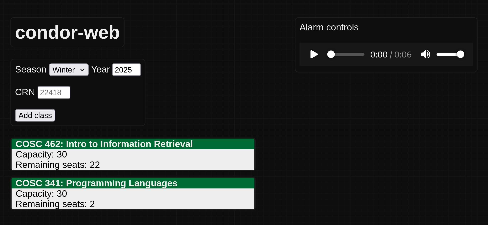

# condor-web

  

A web server designed to report vacancies in Eastern Michigan courses. Built using [condor](https://github.com/massivebird/condor) and [axum](https://github.com/tokio-rs/axum).

Written in Rust 🦀
